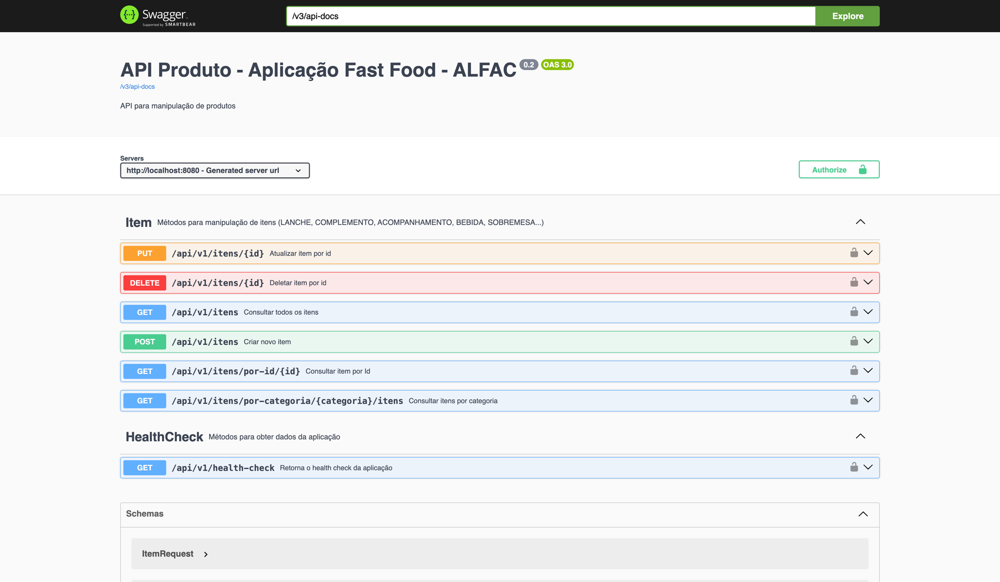

# Microsserviço `food-produto` - ALFAC ·  

Este repositório fornece o microsserviço de gerenciamento dos produtos (itens) da Aplicação Fast Food - ALFAC (veja mais em [https://github.com/ALFAC-Org/food/](https://github.com/ALFAC-Org/food/)).

## Tecnologia

* Linguagem de Programação: Java 17
* Framework: Spring Boot
* Gerenciador de dependências: Maven
* Banco de dados: MySQL 8
* Documentação e uso de API's: Swagger
* Conteinerização: Docker
* Testes unitários: JUnit 5 + Jacoco
* Testes de comportamento (BDD): Cucumber

## Arquitetura

A aplicação está estruturada no padrão de Clean Architecture.

Pode ser executada tanto via Docker e Terraform. Podendo ser hospedada tanto localmente ou na nuvem, usando serviços como AWS.

A interação da aplicação se dá através de APIs com o Swagger disponibilizado.

### Tutoriais

| Passo                                                    | Vídeo |
|----------------------------------------------------------|-------|
| 0. Introdução geral ao repositório                       | --    |
| 1. Executando a aplicação: GitHub Actions _(recomendada)_ | --    |
| 1. Executando a aplicação: Localmente                    | --    |
| 2. Testes: Unitários                                     | --    |
| 2. Testes: BDD                                           | --    |
| 3. Iteragindo com a API                                  | --    |

## Executando a aplicação

### GitHub Actions _(recomendada)_

<details>
  <summary>Passo a passo</summary>

> [!WARNING]  
> **Primeiramente, é necessário configurar a infraestrutura por meio do link: [https://github.com/ALFAC-Org/food-cloud-infra/actions/workflows/create-infraestructure.yml](https://github.com/ALFAC-Org/food-cloud-infra/actions/workflows/create-infraestructure.yml)**

1. Acesse [https://github.com/ALFAC-Org/food-produto/actions](https://github.com/ALFAC-Org/food-produto/actions) (A guia `Actions` deste repositório);
2. Acesse `CI/CD`;
3. Clique em `Run workflow` (ou Executar workflow);
4. Aguarde. Se tudo der certo, o `check` verde deverá aparecer - o processo dura em torno de 2 minutos;


Para acessar a aplicação é necessário acessar a URL da através do Kubernetes, acessando a área de Services e acessando ao serviço `food-produto`.
A URL será algo como: [http://aa326084c74cf48c6a15f7832f4edb95-21c002b943a9cff6.elb.us-east-1.amazonaws.com:8080/api-docs](http://aa326084c74cf48c6a15f7832f4edb95-21c002b943a9cff6.elb.us-east-1.amazonaws.com:8080/api-docs).

</details>

### Localmente

<details>
  <summary>Passo a passo</summary>

No terminal, execute:

```bash
docker compose up
```

Acesse a aplicação da API em:

[http://localhost:8080/api-docs](http://localhost:8080/api-docs)

</details>



## Testes

Certifique-se de instalar as dependências do projeto antes de executar os testes.

Se seu terminal suportar o comando `make`:

```bash
make build-without-tests
```

senão:

```bash
mvn clean install -U -DskipTests
```

### Unitários

<details>
  <summary>Passo a passo</summary>

No terminal, execute:

Se seu terminal suportar o comando `make`:

```bash
make unit-test-coverage
```

senão:

```bash
  mvn clean test -P unit-tests
  ```

Você poderá ver o relatório de cobertura de testes em `target/site/jacoco/index.html`.


Além disso, é possível ver o coverage atualizado nesta página, ao lado do título do repositório.

</details>

### BDD

<details>
  <summary>Passo a passo</summary>

No terminal, execute:

```bash
docker compose up
```

Em outro terminal, execute:

Se seu terminal suportar o comando `make`:

```bash
make bdd-test
```

senão:

```bash
mvn clean test -P bdd-tests
```

Você poderá ver o relatório de cobertura de testes em `target/cucumber-reports/cucumber.html`.


</details>

## Membros

| Nome | RM | E-mail | GitHub |
| --- | --- | --- | --- |
| Leonardo Fraga | RM354771 | [rm354771@fiap.com.br](mailto:rm354771@fiap.com.br) | [@LeonardoFraga](https://github.com/LeonardoFraga) |
| Carlos Henrique Carvalho de Santana | RM355339 | [rm355339@fiap.com.br](mailto:rm355339@fiap.com.br) | [@carlohcs](https://github.com/carlohcs) |
| Leonardo Alves Campos | RM355568 | [rm355568@fiap.com.br](mailto:rm355568@fiap.com.br) | [@lcalves](https://github.com/lcalves) |
| Andre Musolino | RM355582 | [rm355582@fiap.com.br](mailto:rm355582@fiap.com.br) | [@amusolino](https://github.com/amusolino) |
| Caio Antunes Gonçalves | RM354913 | [rm354913@fiap.com.br](mailto:rm354913@fiap.com.br) | [@caio367](https://github.com/caio367) |